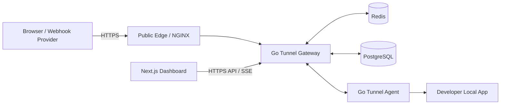

# System Architecture

## 1. High-Level Architecture



## 2. Separation of Control Plane and Data Plane

### Control plane

Handles:

- authentication
- user accounts
- tunnel registration
- API keys/device tokens
- plan and limits
- dashboard queries
- usage summaries

### Data plane

Handles:

- public HTTP requests
- tunnel connection lookup
- request/response forwarding
- WebSocket frames
- low-latency routing

Do not put heavy dashboard logic in the critical data path.

## 3. Main Components

### Tunnel Agent

Runs on developer laptop.

Responsibilities:

- parse CLI args
- authenticate
- request tunnel allocation
- open persistent transport
- forward requests to localhost
- send heartbeat
- reconnect with backoff
- graceful shutdown

### Tunnel Gateway

Responsibilities:

- accept public HTTP traffic
- parse public hostname
- resolve hostname to active tunnel
- enforce limits
- create logical stream/request
- send traffic to connected agent
- return agent response

### Redis

Responsibilities:

- active tunnel state
- connection lookup
- request counters
- bandwidth counters
- rate limit
- distributed lock if multi-node
- short-lived presence/heartbeat

### PostgreSQL

Responsibilities:

- users
- tunnels
- tunnel sessions
- API keys
- plans
- usage aggregates
- request metadata
- audit records

### Dashboard

Responsibilities:

- display state and metrics
- tunnel management
- request inspection
- account and usage settings

## 4. Request Routing

Public host:

```text
https://a8f2x.indotunnel.id
```

The gateway extracts:

```text
subdomain = a8f2x
```

Then resolves:

```text
a8f2x -> active tunnel session -> agent connection
```

## 5. Scaling Model

Initial deployment may run on one VPS:

```text
NGINX
Go API/Gateway
Redis
PostgreSQL
```

At scale:

```text
                    DNS
                     |
          +----------+----------+
          |                     |
       Edge-01               Edge-02
          |                     |
       Gateway               Gateway
          \                     /
           +------- Redis -----+
                    |
                PostgreSQL
```

Active session mapping must work across gateway nodes.

## 6. Critical Design Rule

Never route public traffic directly to a laptop IP. The laptop only needs outbound connectivity to the tunnel infrastructure.
