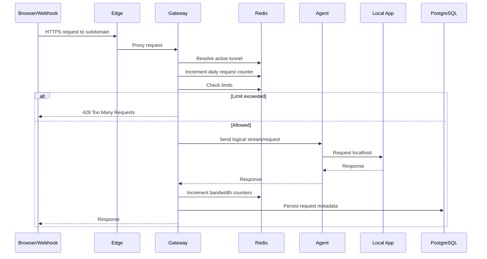

# Public Request Flow

## 1. Request Lifecycle



## 2. Required Request Metadata

At minimum:

- request ID
- tunnel ID
- user ID
- timestamp
- method
- path
- host
- status code
- request size
- response size
- latency
- hashed client IP

## 3. Body Storage

MVP should not persist request/response bodies by default.

For future inspector/replay:

- explicit opt-in body capture
- size cap
- content-type allowlist
- retention limit
- masking of sensitive headers

## 4. WebSocket

For WebSocket:

```text
Browser
  |
  | Upgrade
  v
Gateway
  |
  | logical tunnel stream
  v
Agent
  |
  v
localhost WebSocket server
```

The tunnel must preserve upgrade semantics and bidirectional frames.
