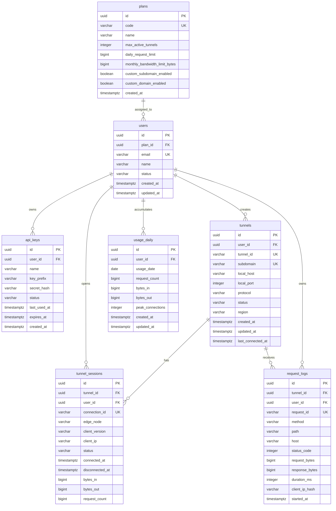

# ERD

## 1. Entity Relationship Diagram

## 2. Relation Notes

- `users -> tunnels`: a user may own many historical tunnels but Free is restricted to one active tunnel.
- `tunnels -> tunnel_sessions`: one tunnel may have many sessions over its lifetime because agents reconnect.
- `tunnels -> request_logs`: all traffic metadata is associated with the tunnel.
- `usage_daily`: pre-aggregated usage for dashboard and billing.
- `api_keys`: store only a hash of the secret, never the raw key.

## 3. Identity vs Network

User identity comes from account/authentication.

Network identity (`client_ip`) is used for:

- abuse prevention
- suspicious activity detection
- operational diagnostics

Do not use public IP as the database primary identity of a developer.
