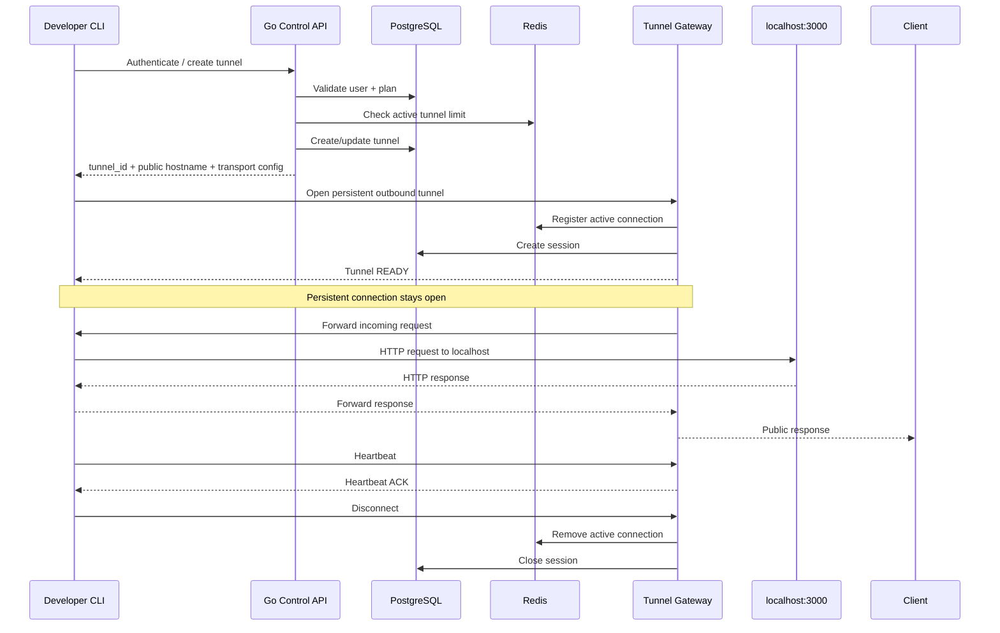

# Tunnel Flow

## 1. Complete Tunnel Lifecycle



## 2. CLI Startup

```text
indotunnel 3000
      |
      +-- parse target
      |
      +-- load credential
      |
      +-- POST /v1/tunnels
      |
      +-- receive tunnel_id/subdomain
      |
      +-- open tunnel transport
      |
      +-- register connection
      |
      +-- print public URL
      |
      +-- heartbeat loop
      |
      +-- request forwarding loop
```

## 3. Reconnect

When connection breaks:

```text
CONNECTED
   |
   X network lost
   |
DISCONNECTED
   |
backoff 1s
   |
retry
   |
backoff 2s
   |
retry
   |
backoff 4s
   |
CONNECTED
```

Suggested maximum backoff: 30 seconds with jitter.

## 4. Shutdown

On `Ctrl+C`:

1. stop accepting new local work
2. send graceful close
3. close transport
4. server marks session disconnected
5. public hostname returns a tunnel-offline response

## 5. Offline Public Response

Suggested:

```http
HTTP/1.1 502 Bad Gateway
Content-Type: application/json
```

```json
{
  "error": "tunnel_offline",
  "message": "The local developer tunnel is currently offline."
}
```
